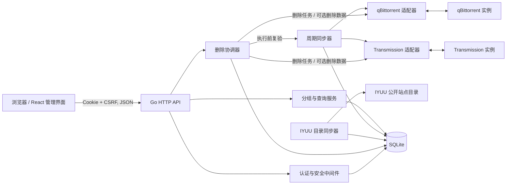
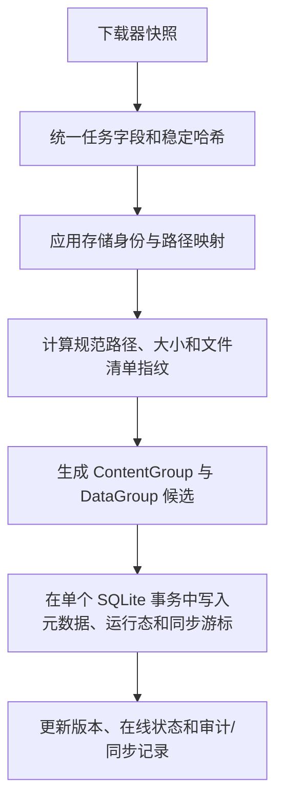
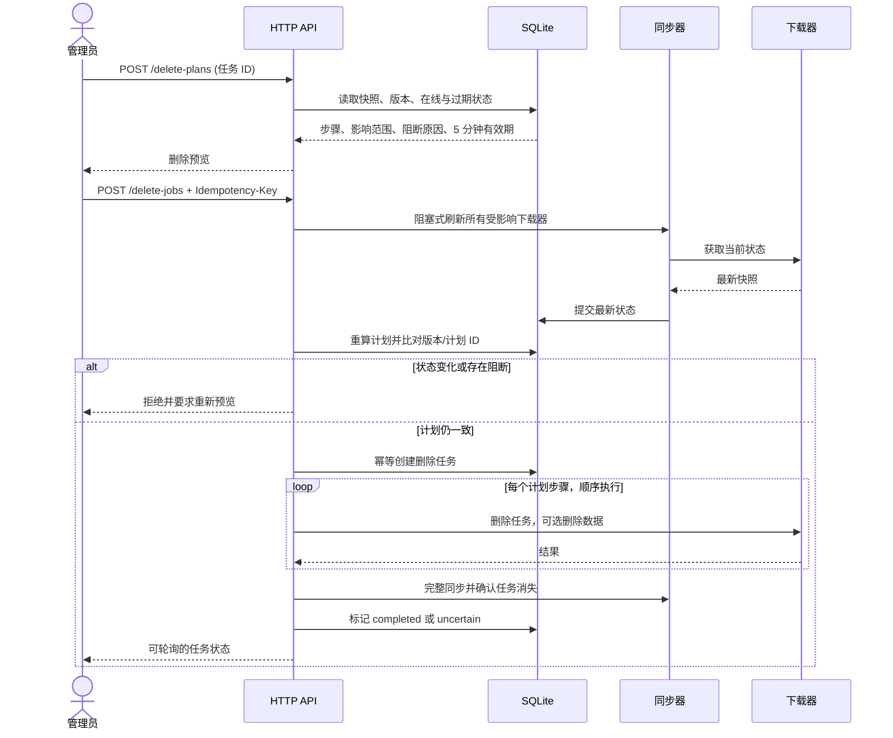

# SeedGraph 架构说明

## 目标与边界

SeedGraph 是一个单用户、自托管的聚合控制面。它读取 qBittorrent/Transmission 的状态、整理任务之间的关系，并把经过安全规划的删除指令发送回下载器。它不代理 BT 流量，也不直接遍历或删除下载目录中的文件。

系统最重要的约束是：**逻辑内容关系与物理数据引用必须独立建模。** 界面中的合并操作不能改变物理引用计数；只有经过验证的 `DataGroup` 才能授权删除数据。

## 组件

代码职责：

| 目录 | 职责 |
| --- | --- |
| `cmd/seedgraph` | 进程装配、信号处理、HTTP 生命周期。 |
| `internal/httpapi` | 路由、输入验证、会话/CSRF、安全响应头和 API 表达。 |
| `internal/downloader` | qBittorrent 与 Transmission 客户端适配。 |
| `internal/syncer` | 增量/完整同步、标准化、Tracker 归类和自动分组。 |
| `internal/iyuu` | IYUU 公开站点目录客户端、整批校验、限频与每日同步。 |
| `internal/domain` | 路径规范化、分组、版本计算和安全删除规划等纯领域逻辑。 |
| `internal/deletion` | 删除预览复验、幂等任务编排、顺序执行和结果确认。 |
| `internal/store` | SQLite 迁移、事务与查询。 |
| `internal/auth`、`internal/cryptox` | 密码、会话和凭据加密。 |
| `internal/webui` | React 构建产物的 SPA 静态服务。 |
| `frontend` | React、TypeScript、Ant Design 与 TanStack Query 管理界面。 |

## 同步与标准化

启动时会对已启用的下载器执行完整同步，随后按 `SEEDGRAPH_SYNC_INTERVAL` 调度增量同步，并按 `SEEDGRAPH_FULL_SYNC_INTERVAL` 定期重新获取完整快照。

下载器任务使用 torrent hash 作为稳定外部键。Transmission 的数字 ID 可能复用，因此只作为远端定位信息，不能充当持久身份。

路径先绑定到 `StorageID`，再通过最长前缀映射得到规范路径。只有处于同一存储身份、规范路径与大小兼容，并且文件清单证据不冲突的任务，才可能进入同一物理分组。相同文本路径如果属于不同存储，仍然代表不同副本。

## 分组模型

### ContentGroup

`ContentGroup` 是逻辑资源：

- 用于列表展示、筛选、逻辑大小和唯一站点计数。
- 可以自动生成，也可以手动合并、拆分、移动成员、锁定或恢复自动模式。
- 手动关系会保留，后续自动同步不会覆盖它。
- 合并、拆分和移动会记录版本化操作快照；撤销前会原子校验所有受影响组和成员，状态漂移时拒绝回滚。
- 不参与“最后一个物理引用”的判断。

### DataGroup

`DataGroup` 是物理引用集合：

- 由 `StorageID`、规范路径、目标字节数和已选文件清单指纹共同描述。
- 置信度可以是 `tentative`、`verified` 或 `manual`。
- `tentative` 分组不能授权文件删除。
- ContentGroup 的编辑不会改变 DataGroup 成员关系。

每个任务的 `Membership` 同时保存 `ContentGroupID` 和 `DataGroupID`，让两种关系始终显式可见。组和任务的版本号用于检测预览后发生的状态漂移。

## 两阶段删除

删除不是单次 API 调用，而是可审计的两阶段流程。

规划器按 DataGroup 做引用计数。只有当选中的任务覆盖某个 DataGroup 的最后活动引用时，对应的一个步骤才会携带“删除数据”；其他步骤只删除下载器任务。典型阻断包括：

- 下载器离线或状态超过 `SEEDGRAPH_STALE_AFTER`。
- 缺失 ContentGroup/DataGroup 或组版本不一致。
- DataGroup 仍是未验证状态。
- 物理路径被另一个 DataGroup 占用。
- 预览已过期，或执行前同步发现状态变化。

远端删除请求失败时，系统无法证明下载器是否已经应用了操作，因此不会盲目重试，而是把步骤/任务标记为 `uncertain` 并停止后续步骤。客户端提交 `Idempotency-Key` 可避免重复创建同一删除任务，但不能把不确定的远端副作用变成可安全重试。

## 数据与一致性

- SQLite 是应用元数据的唯一持久状态，使用纯 Go 驱动，因此发布二进制不依赖 CGO。
- 同步快照、任务元数据、运行态、组成员关系和同步游标在事务边界内更新。
- 数据库记录下载计划、删除步骤和审计事件，使进度与失败状态可以在界面中追踪。
- 下载器用户名和密码使用 `SEEDGRAPH_SECRET_KEY` 加密后持久化；密钥本身不进入数据库。
- Tracker 只持久化去除 passkey 的 host/path 身份和用户定义的站点规则。
- IYUU 目录以独立快照保存并保留上游缺失的旧行；它不包含可靠的 announce 域名，因此不会自动生成权威 Tracker 规则。

SQLite 文件和密钥应一起纳入备份策略。数据库备份不包含下载器中的真实 torrent 数据。

## HTTP 与安全模型

服务暴露 `/api/v1` 和 `/healthz`，并把其他路径交给 SPA handler。当前安全模型面向单个 `admin` 用户：

- 启动时从环境变量读取管理密码，并在 SQLite 中保存其密码哈希。
- 登录成功后签发 12 小时的 HttpOnly、SameSite=Strict 会话 Cookie。
- 除登录外的受保护修改请求必须提供与会话绑定的 `X-CSRF-Token`。
- 登录按客户端地址限速；请求体限制为 1 MiB。
- 响应包含 CSP、禁止 iframe、MIME sniffing、referrer 和浏览器权限限制等安全头。
- 下载器凭据不会从列表 API 返回明文。

`SEEDGRAPH_COOKIE_SECURE=true` 要求浏览器通过 HTTPS 访问。默认 Compose 仅绑定 `127.0.0.1`；若开放到其他接口，应在可信反向代理后提供 TLS，并限制网络访问范围。

## 构建与发布

多阶段 Docker 构建先用 Node.js 24 生成前端资源，再用 Go 1.24 构建静态后端，最终运行于非 root 的 Alpine 用户。运行时根文件系统在 Compose 中只读，只有 `/data` 命名卷与 `/tmp` tmpfs 可写，并移除 Linux capabilities。

CI 分为 Go、Frontend 和 Docker 三个作业；只有前两者通过后才构建并冒烟测试镜像。SemVer 标签发布多架构 GHCR 镜像，同时生成 SBOM、来源证明和 GitHub Release。
